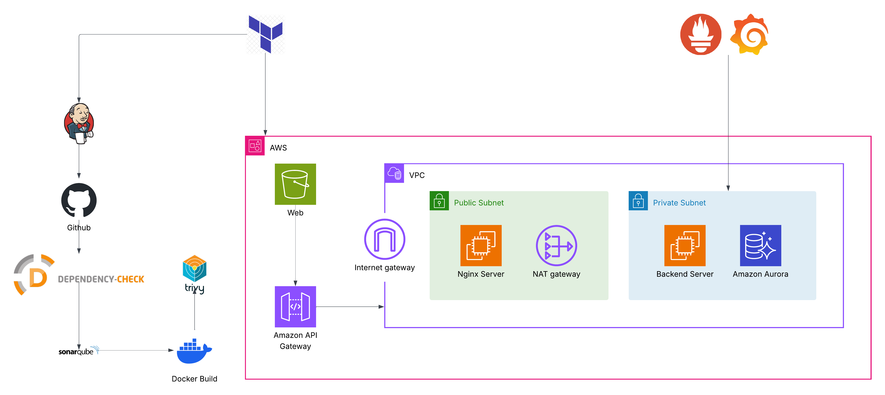

# Phufa Cafe POS System

[](https://opensource.org/licenses/MIT)

## Overview

Phufa Cafe POS System is a full-stack, web-based Point of Sale (POS) application designed to streamline operations for coffee shops, specifically modeled after "Phufa Café". This system aims to replace manual, paper-based processes with a digital solution for order taking, payment processing, and sales reporting. By using digital devices like tablets or computers, the system reduces errors, speeds up service, and provides real-time sales insights for better business management.

## Architecture



The system uses a modern cloud-native architecture:
- **Frontend**: Next.js (React) application styled with Tailwind CSS, interacting with the backend via RESTful APIs.
- **Backend**: Node.js (Express) server handling business logic, authentication, and database interactions.
- **Database**: MariaDB relational database for storing menus, orders, customer data, and employee records.
- **Infrastructure**: AWS infrastructure managed via Terraform, including EC2/Compute, RDS (for MariaDB), S3 (for uploads/assets), ECR (for Docker images), and API Gateway.
- **Deployment**: Automated via Jenkins CI/CD pipelines and configured using Ansible.

## Folder Structure

```text
.
├── ansible/                 # Ansible playbooks for server and Nginx configuration
├── backend/                 # Node.js Express backend application
│   ├── src/                 # Source code (controllers, routes, middlewares, etc.)
│   ├── tests/               # Backend unit and integration tests
│   └── docs/                # API specifications
├── frontend/                # Next.js frontend application
│   └── src/                 # Components, pages, contexts, services
├── Jenkins-pipeline-code/   # Jenkinsfiles for CI/CD pipelines
├── monitoring/              # Prometheus and Grafana configuration for system monitoring
├── terraform/               # Terraform configurations for AWS infrastructure
└── uploads/                 # Uploaded media assets (menus, profiles)
```

## Features

*   **Menu Management:** Add, edit, delete, and change the status of menu items and view recipes.
*   **Order Taking & Management:** Employees can digitally record customer orders and update order statuses (e.g., pending, paid).
*   **Automated Calculation & Receipt Generation:** The system automatically calculates order totals based on items and customizations.
*   **Sales Reporting:** Track sales data in real-time and generate daily sales summary reports for the owner.
*   **Employee Management:** Add and edit employee information (name, role, salary) and manage system access.
*   **Customer Management:** Manage customer information.
*   **Customer Loyalty Program:** Implement a point-based system for customers to accumulate points and redeem rewards (e.g., free drinks).
*   **Inventory Management:** Manage ingredients/stock levels, automatically updating quantities based on menu items sold according to their recipes.

## Technology Stack

* **Frontend:** Next.js, React, Tailwind CSS
* **Backend:** Node.js (Version 22), Express
* **Database:** MariaDB (Version 11)
* **Infrastructure & Deployment:** Docker, AWS (Terraform), Jenkins, Ansible
* **Monitoring:** Prometheus, Grafana

## API Documentation

The backend exposes a RESTful API. The API specification is documented in JSON format.
- You can find the detailed API specifications in `backend/src/docs/api-spec.json`.
- The API includes endpoints for `/auth`, `/customer`, `/employee`, `/ingredient`, `/menu`, `/order`, `/report`, and `/upload`.

## CI/CD Pipeline & Deployment

The project uses Jenkins for Continuous Integration and Continuous Deployment.
- **Pipelines:** Defined in the `Jenkins-pipeline-code/` directory (`Jenkinsfile-backend`, `Jenkinsfile-frontend`, `Jenkinsfile-tf`).
- **Infrastructure as Code (IaC):** Terraform is used to provision AWS resources (`terraform/`).
- **Configuration Management:** Ansible (`ansible/`) is used to set up the application servers and configure Nginx as a reverse proxy.

## Monitoring

System monitoring and observability are configured using Prometheus and Grafana.
- Configuration files are located in the `monitoring/` directory.
- It includes a `docker-compose.yml` specifically for spinning up the monitoring stack, along with `prometheus.yml` and `grafana.yml` configurations.

## License

This project is licensed under the [MIT License](LICENSE) - see the [LICENSE.md](LICENSE.md) file for details.

## Acknowledgments

* This project was developed as a student project.
* Thanks to Phufa Café for providing the real-world context for this project.
